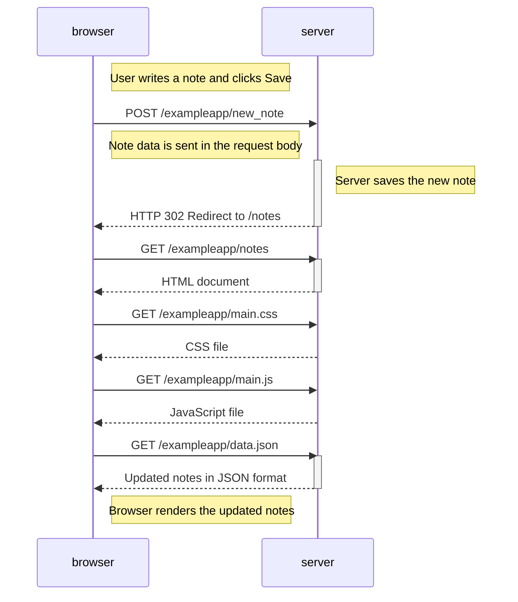

```mermaid
sequenceDiagram
    participant browser
    participant server

    Note right of browser: User writes a note and clicks Save

    browser->>server: POST /exampleapp/new_note
    Note right of browser: Note data is sent in the request body

    activate server
    Note right of server: Server saves the new note
    server-->>browser: HTTP 302 Redirect to /notes
    deactivate server

    browser->>server: GET /exampleapp/notes
    activate server
    server-->>browser: HTML document
    deactivate server

    browser->>server: GET /exampleapp/main.css
    server-->>browser: CSS file

    browser->>server: GET /exampleapp/main.js
    server-->>browser: JavaScript file

    browser->>server: GET /exampleapp/data.json
    activate server
    server-->>browser: Updated notes in JSON format
    deactivate server

    Note right of browser: Browser renders the updated notes
```